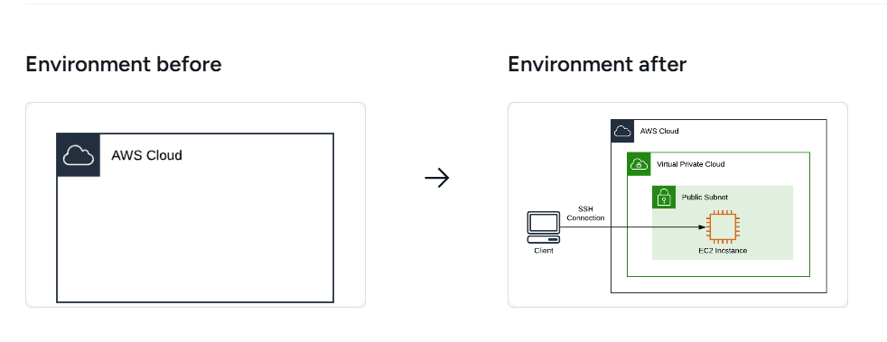

# Amazon-ec2-instance
I launched and configured an EC2 instance on AWS and connected to it using SSH. I explored instance states and retrieved metadata from inside the machine. Finally, I terminated the instance to clean up resources and avoid extra costs.
# EC2 Instance Lifecycle & Access Lab

Hands-on lab where I provision, access, inspect, and terminate an AWS EC2 instance.

## Overview

In this lab, I worked through the full lifecycle of an EC2 instance on AWS. I launched a Linux virtual machine, connected to it using SSH, explored some internal details like metadata, and then cleaned everything up.

It’s a basic workflow, but it reflects what I’d actually do when working with cloud infrastructure.

## What I did

- Launched an EC2 instance

- Observed and understood instance states

- Generated and used an SSH key pair

- Connected to the instance from my local machine

- Retrieved instance metadata from within the VM

- Terminated the instance after use

## Flow

Local Machine -> SSH -> EC2 Instance (AWS) -> Metadata Service

## Key learnings

- How EC2 instance states impact availability and cost

- Why SSH key-based authentication is used instead of passwords

- How to access instance metadata from inside the machine

- The importance of terminating resources to avoid unnecessary charges

## Steps to reproduce

- Launch an EC2 instance from the AWS Console

- Create or download an SSH key pair

- Connect to the instance using SSH

- Run commands to query instance metadata

- Terminate the instance

## Tech stack

- AWS EC2

- Linux (Amazon Linux)

- SSH

- Bash

## Note

I made sure to terminate all resources after completing the lab to avoid unexpected charges.

### Lab steps
- Logging In to the Amazon Web Services Console
- Creating an Amazon EC2 Instance
- Connecting to the Virtual Machine using EC2 Instance Connect
- Converting a PEM Key to a PPK Key (Windows Users Only)
- Connecting to an Instance Using SSH
- Getting Amazon EC2 Instance Metadata
- Terminating an Amazon EC2 Instance

### Covered topics
- Compute
- High Availablity
- Amazon EC2
- AWS